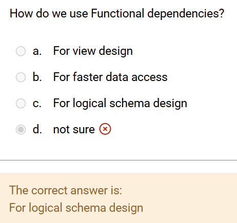

# DBSys

## review of entry test

1. 

- functional dependency

    A functional dependency occurs when one attribute uniquely determines another attribute within a relation. It is a constraint that describes how attributes in a table relate to each other. If attribute A functionally determines attribute B we write this as the A→B.
    
    Example:

    |roll_no|	name|	dept_name|	dept_building|
    |---|---|---|---|
    |42	|abc|	CO|	A4|
    |43	|pqr|	IT|	A3|
    |44	|xyz|	CO|	A4|

    some valid functional dependencies:

    - roll_no → { name, dept_name, dept_building }
    - dept_name → dept_building

- logical schema

    