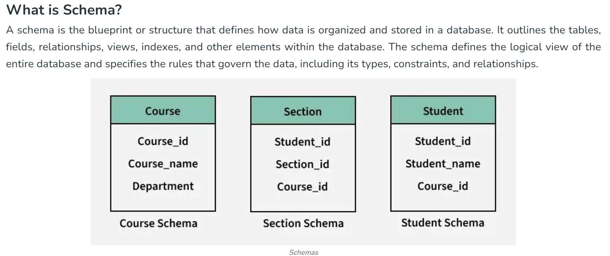
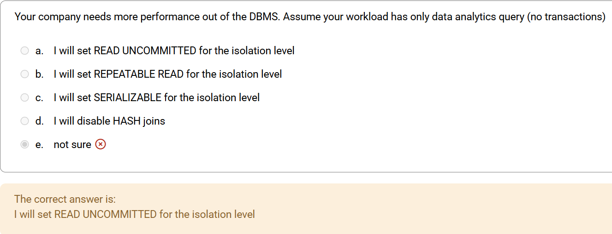
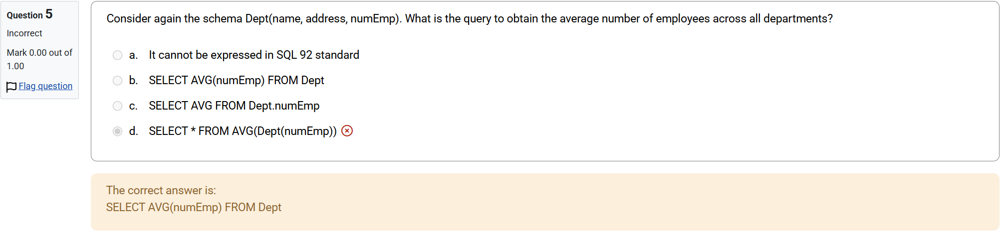

# DBSys

## review of entry test

1. 

- functional dependency

    A functional dependency occurs when one attribute uniquely determines another attribute within a relation. It is a constraint that describes how attributes in a table relate to each other. If attribute A functionally determines attribute B we write this as the A→B.
    
    Example:

    |roll_no|	name|	dept_name|	dept_building|
    |---|---|---|---|
    |42	|abc|	CO|	A4|
    |43	|pqr|	IT|	A3|
    |44	|xyz|	CO|	A4|

    some valid functional dependencies:

    - roll_no → { name, dept_name, dept_building }
    - dept_name → dept_building

- logical schema

    

2. 

- isolation
    
    Isolation is one of the transaction properties of database systems. Higher isolation, lower risk of concurrecy effects, higher demand for resources.

- read phenomena

- isolation levels

    These are used to control the level of concurrency. From high to low, 4 isolation levels:
    
    - serializable

        Keeps read and write locks on selected data.Requires range-locks when a SELECT query uses a ranged WHERE clause.

    - repeatable reads

        No range locks. Phantom reads can occur.

    - read commited

        Keeps write lock till the end of the transaction, but read locks are released as soon as the SELECT operation is performed. Non-repeatable reads phenomenon can happen.
    - read uncommited

        Dirty reads can happen. 

3. 

